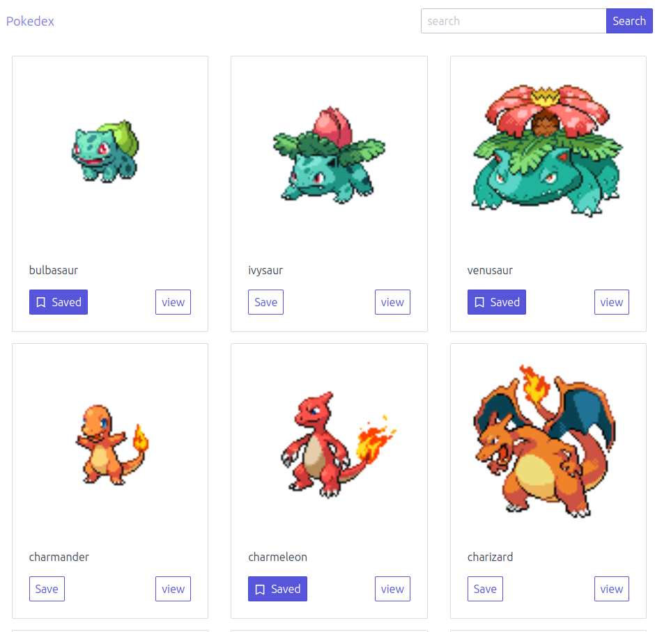
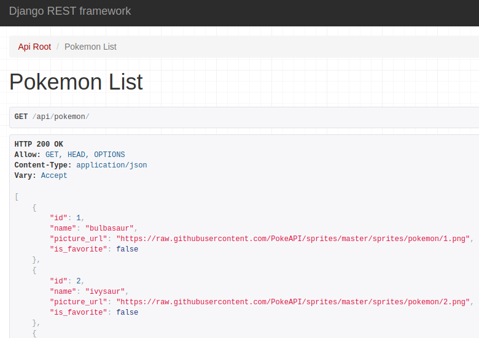

# pokedex
DearDoc full stack code challengue

## Description
Pokedex is a web application that allows users to browse through the first 151 Pokemons, filter them by name, and save their favorites. It provides a user-friendly interface to explore and manage Pokemon data.

## Stack
- Frontend: React
- CSS Framework: Spectre.css
- Backend: Django with Django REST Framework
- Database: PostgreSQL
- Containerization: Docker
- Testing: Pytest

## How to Run
1. Clone the repository:
   ```bash
   git clone git@github.com:PopocaOrtiz/pokedex.git
   ```

2. Navigate to the project directory:
   ```
   cd pokedex
   ```

3. Run Docker Compose to start the frontend and backend:
   ```
   docker-compose up
   ```

4. Create a User
   To create a user, use the createsuperuser command inside the django container:
   ```
   python manage.py createsuperuser --username myuser --email myuser@example.com
   ```
   The first user created will always be used by default.

4. Access the frontend at http://localhost:3000 and the backend api at http://localhost:8000.

## Endpoints

- **GET** `/api/pokemon/`: Returns the list of Pokemons.
- **POST** `/api/pokemon/{id}/mark_as_favorite/`: Saves a Pokemon as a favorite.
- **DELETE** `/api/pokemon/{id}/mark_as_favorite/`: Un-saves a Pokemon from favorites.

## Commands
### Import Pokemon Data
To import data of the first 151 pokemons using the PokeAPI, run:
```
python manage.py import_pokemon_data
```

### Run tests
To run backend tests, using pytest inside the django container, run:
```
pytest
```

## Screenshots
### Frontend

### Backend

